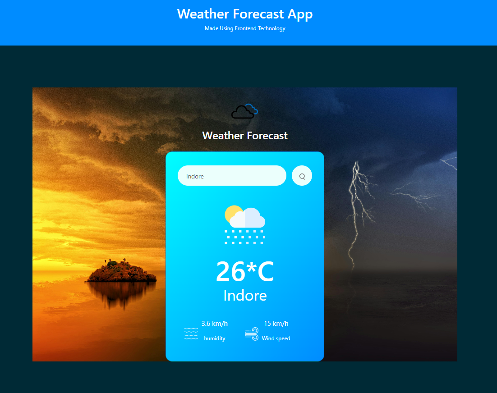

 # Weather Forecast App 🌦️

A responsive **Weather Forecast App** built using HTML, CSS, and JavaScript, leveraging the OpenWeatherMap API to display real-time weather details of any city.

---

## Features 🗋

- Displays temperature, humidity, and wind speed.
- Dynamic icons for different weather conditions (Cloudy, Rainy, Clear, etc.).
- Responsive design with a visually appealing UI.
- Real-time error handling for invalid city names.

---

## Demo 🎥

[Live Demo](#) *(https://ashwin-chavhan-121.github.io/weather-app/)*

---

## Tech Stack 🛠️

- **Frontend**: HTML, CSS, JavaScript
- **API**: [OpenWeatherMap](https://openweathermap.org/)
- **Design Framework**: [Bootstrap](https://getbootstrap.com/)

---

## Installation 🚀

1. Clone the repository:
   ```bash
   git clone https://github.com/ASHWIN-CHAVHAN-121/weather-app.git
   ```
2. Navigate to the project directory:
   ```bash
   cd weather-app
   ```
3. Open `index.html` in your browser to run the app.

---

## Usage ✨

1. Enter a city name in the search bar.
2. Click the **Search** button.
3. View the weather details, including temperature, humidity, and wind speed.

---

## Screenshots 📸

 

---

## Project Structure 🗁

```
weather-forecast-app/
├── assets/              # Images and icons
├── style.css            # Styling for the app
├── script.js            # JavaScript logic
├── index.html           # Main HTML file
```

---

## API Key 🔑

Replace the `apiKey` value in `script.js` with your API key from [OpenWeatherMap](https://home.openweathermap.org/api_keys).

---

## License 📄

This project is licensed under the MIT License. Feel free to use and modify it as needed!

---
